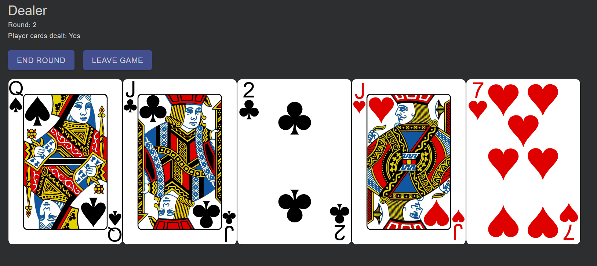
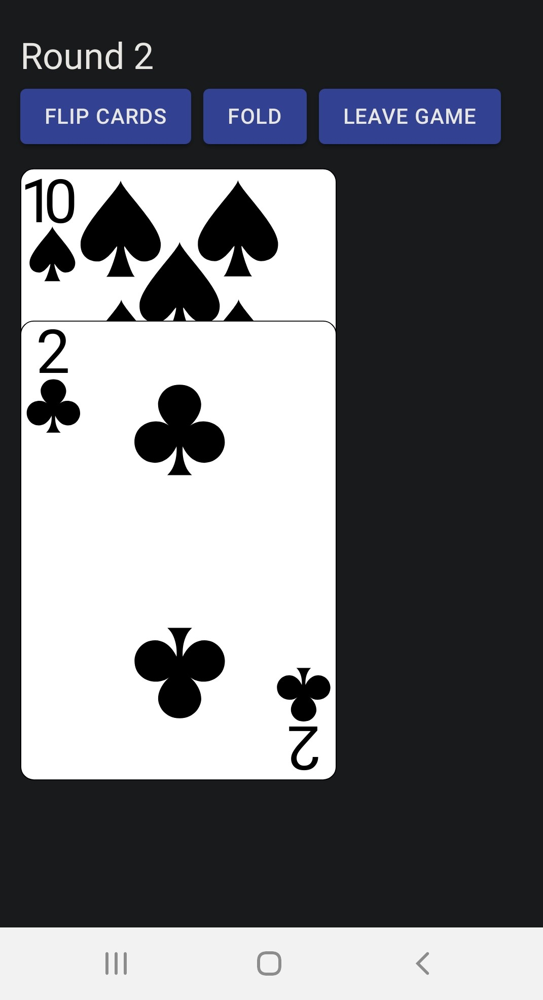
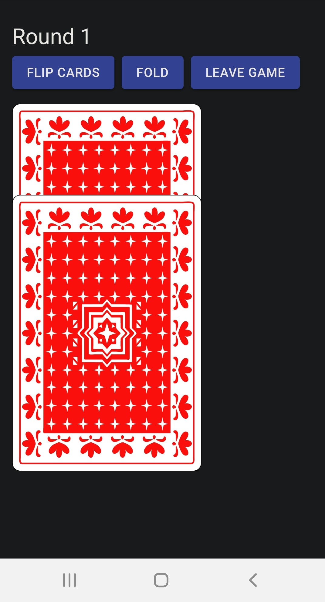

# LanPoker

Fullstack implementation of a virtual deck and dealer for a LAN-based Texas Hold Em game.

Link to demo: https://youtu.be/m66jeSDBZgg

## Screenshots

|||
|------------|-------------|
|  |  |

## Background
My friends and I play poker regularly. One of my friends is quadriplegic, and has limited use of his fingers; as a result, it's sometimes difficult for him to hold cards in his hand. I thought it might be nice if we could deal the cards to show up on his phone, which is much easier to hold. So that became the goal of this project: a virtual deck that can deal cards for a poker game to phones. (Also, it'd be nice not to re-shuffle the deck by hand every round!)

This is not meant to be a completely online application; it is intended to be played in person, at a table with friends. Some of the mechanics, such as betting or determining the winning hand, are still done outside the application, as they would be with a physical card deck. The idea here is that the deck itself is virtualized, as well as the flow of dealing, collecting, and re-shuffling cards between rounds.

## Installation
```
npm run install-deps
npm run build
npm start
```
Once server is running, go to http://localhost:3001/
Players can enter the game by accessing the server over the local network.

### For Development

```
npm run install-deps
npm run start-dev
```

## How it works
This application consists of a React front end, communicating with an Express server, which handles game and card deck state. 
Socket.IO is used for triggering the card dealing events.
